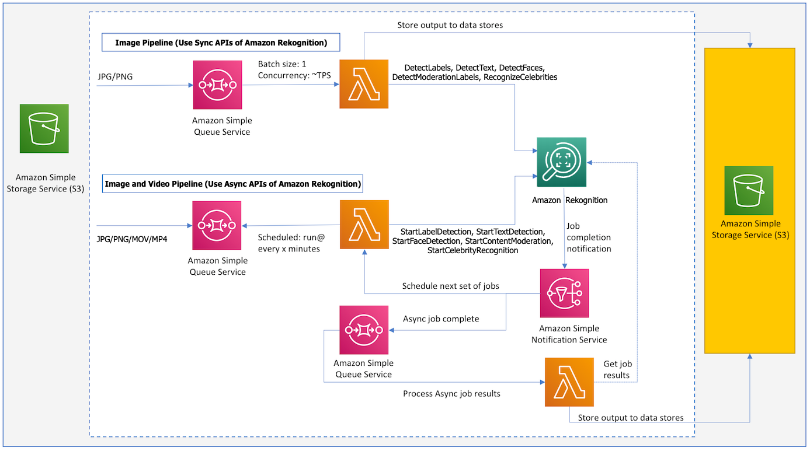
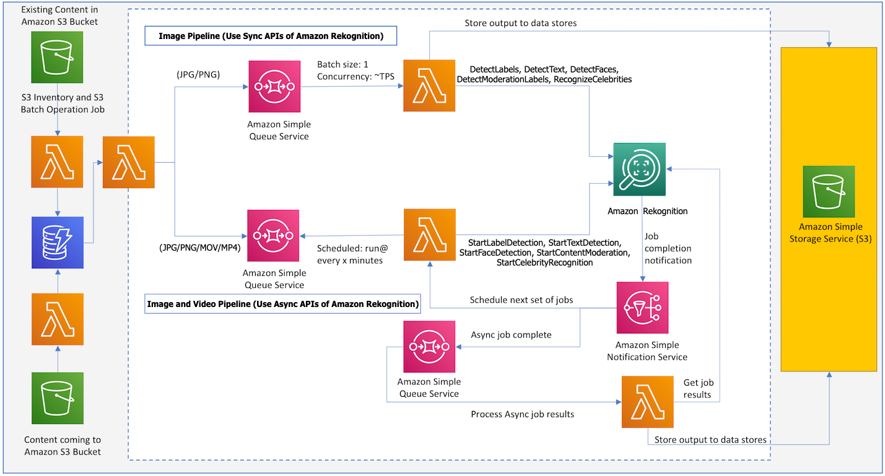

# Large scale image and video processing with Amazon Rekognition
This reference architecture shows how you can extract insights from images and videos at scale using Amazon Rekognition. Below are some of key attributes of reference architecture:
- Process incoming images and videos to an Amazon S3 bucket.
- Process large backfill of existing images and videos in an Amazon S3 bucket.
- Serverless, highly available and highly scalable architecture.
- Easily handle spiky workloads.
- Pipelines to support both Sync (for images) and Async (for vidoes) APIs of Amazon Rekognition.
- Control the rate at which you process images and videos without doing any complex distributed job management. This control can be important to protect your downstream systems which will be ingesting output from Rekognition.
- Sample implementation which takes advantage of [AWS Cloud Development Kit (CDK)](https://docs.aws.amazon.com/cdk/latest/guide/home.html) to define infrastructure in code and provision it through CloudFormation.

## Architecture
Architecture below shows the core components. 

### Image pipeline (Use Sync APIs of Amazon Rekognition)
1. The process starts as a message is sent to an Amazon SQS queue to analyze an image.
2. A Lambda function is invoked synchronously with an event that contains queue message.
3. Lambda function then calls Amazon Rekognition and store the result in different datastores for example DynamoDB, S3 or Elasticsearch.

You control the throughput of your pipeline by controlling the batch size and lambda concurrency.

### Video pipeline (Use Async APIs of Amazon Rekognition)
1. The process starts when a message is sent to an SQS queue to analyze a video.
2. A job scheduler lambda function runs at a certain frequency for example every 5 minutes and poll for messages in the SQS queue.
3. For each message in the queue it submits an Amazon Rekognition job to process the video and continue submitting these jobs until it reaches the maximum limit of concurrent jobs in your AWS account.
4. As Amazon Rekognition is finished processing a video it sends a completion notification to an SNS topic.
5. SNS then triggers the job scheduler lambda function to start the next set of Amazon Rekognition jobs.
6. SNS also sends a message to an SQS queue which is then processed by a Lambda function to get results from Amazon Rekognition and store them in a relevant dataset for example DynamoDB, S3 or Elasticsearch.

Your pipeline runs at maximum throughput based on limits on your account. If needed you can get limits raised for concurrent jobs and the pipeline automatically adapts based on new limits.

## Image and video processing workflow
Architecture below shows overall workflow and few additional components that are used in addition to the core architecture described above to process incoming images/videos as well as large backfill.

### Process incoming images/videos workflow
1. An image or video gets uploaded to an Amazon S3 bucket. It triggers a Lambda function which writes a task to process the image/video to DynamoDB.
2. Using DynamoDB streams, a Lambda function is triggered which writes to an SQS queue in one of the pipelines.
3. Images/videos are processed as described above by "Image Pipeline" or "Video Pipeline".

### Large backfill of existing images/videos workflow
1. Images/videos already exist in an Amazon S3 bucket.
2. We create a CSV file or use [S3 inventory](https://docs.aws.amazon.com/AmazonS3/latest/dev/storage-inventory.html) to generate a list of images/videos that needs to be processed.
3. We create and start an Amazon S3 batch operations job which triggers a Lambda for each object in the list.
4. Lambda writes a task to process each image/video to DynamoDB.
5. Using DynamoDB streams, a Lambda is triggered which writes to an SQS queue in one of the pipelines.
6. Images/videos are processed as described above by "Image Pipeline" or "Video Pipeline".

## Prerequisites
- Node.js
- [AWS CLI](https://docs.aws.amazon.com/cli/latest/userguide/cli-chap-install.html)

## Setup
- Download this repo on your local machine
- Install [AWS Cloud Development Kit (CDK)](https://docs.aws.amazon.com/cdk/latest/guide/what-is.html): npm install -g aws-cdk
- Go to folder rekognition-pipeline and run: npm install

## Deployment
- Run "cdk bootstrap"
- Run "cdk deploy" to deploy stack

## Test incoming images/videos
- Go to the Amazon S3 bucket "rekognitionpipeline-contentbucketxxxx" created by the stack and upload few sample images/videos (jpg/jpeg, png, mp4, mov) in folders for respective Rekognition APIs.
- Go to "sync" and "async" folders within Amazon S3 bucket "rekognitionpipeline-outputbucketxxxx" created by the stack and you will find output files generated for each item with a folder name "{filename}-analysis".

## Test existing backfill images/videos
- Go to the Amazon S3 bucket "rekognitionpipeline-existingcontentbucketxxxx" create by the stack and upload few sample images/videos (jpg/jpeg, png, mp4, mov) in folders for respective Rekognition APIs.
- Go to the Amazon S3 bucket "rekognitionpipeline-inventoryandlogsxxxxx" and upload a csv file containing the list of item names you just uploaded to the bucket "rekognitionpipeline-existingcontentbucketxxxx". CSV file should have two columns bucketName,objectName. See [example](./inventory-test.csv).
- If you choose, in replacement of the above step, you can use [Amazon S3 Inventory](https://docs.aws.amazon.com/AmazonS3/latest/dev/storage-inventory.html) to automatically generate a list of items in your Amazon S3 bucket.
- Go to S3 in AWS Console and click on Batch Operations.
- Click on Create job, select CSV or S3 inventory report and click Next.
- Under Choose operation: select Invoke AWS Lambda function.
- Under Invoke AWS Lambda function: select "RekognitionPipeline-S3BatchProcessorxxxx" and click Next.
- Under path to completion report destination: browse and select Amazon S3 bucket "rekognitionPipeline-inventoryandlogsxxxxx".
- Under Permissions: for IAM role, select "RekognitionPipeline-S3BatchOperationRolexxxx" and click Next.
- Review and click Create job.
- From Amazon S3 Batch operations page, click on the Job ID link for the job you just created.
- Click "Confirm and run" and then "Run job".
- From S3 Batch operations page, click refresh to see the job status.
- Go to "sync" and "async" folders within Amazon S3 bucket "rekognitionpipeline-outputbucketxxxx" and you should see output generated for items in your list.

## Source code
- [s3batchproc.py](./src/s3batchproc.py) Lambda function that handles event from S3 Batch operation job.
- [s3proc.py](./src/s3proc.py) Lambda function that handles s3 event for an object creation.
- [docproc.py](./src/docproc.py) Lambda function that push images/videos to queues for sync or async pipelines.
- [syncproc.py](./src/syncproc.py) Lambda function that takes images from a queue and process them using sync APIs.
- [asyncproc.py](./src/asyncproc.py) Lambda function that takes video from a queue and start async Amazon Rekognition jobs.
- [jobresultsproc.py](./src/jobresultsproc.py) Lambda function that process results for a completed Amazon Rekognition async job.
- [rekognition-pipeline-stack.ts](./rekognition-pipeline/lib/rekognition-pipeline-stack.ts) CDK code to define infrastructure including IAM roles, Lambda functions, SQS queues etc.

## Modify source code and update deployed stack
- You can edit lambda functions in src folder.
- Shared code is added as Lambda layers and automatically added  to different lambda functions.
- Copy updated lambda functions to appropriate folders: "sh build.sh".
- Deploy changes: "cdk deploy".
- Produce and view CloudFormation template if needed: "cdk synth".
- Produce and export CloudFormation template if needed: "cdk synth -o rekognitioncf".

## Cost
- As you deploy this reference architecture, it creates different resources (Amazon S3 bucket, Amazon DynamoDB table, and AWS Lambda functions etc.). When you analyze images/videos, it calls different APIs (Amazon Rekognition) in your AWS account. You will get charged for all the API calls made as part of the analysis as well as any AWS resources created as part of the deployment. To avoid any recurring charges, delete stack using "cdk destroy".

## Delete stack
- Run: cdk destroy

## License
This library is licensed under the MIT-0 License. See the LICENSE file.
